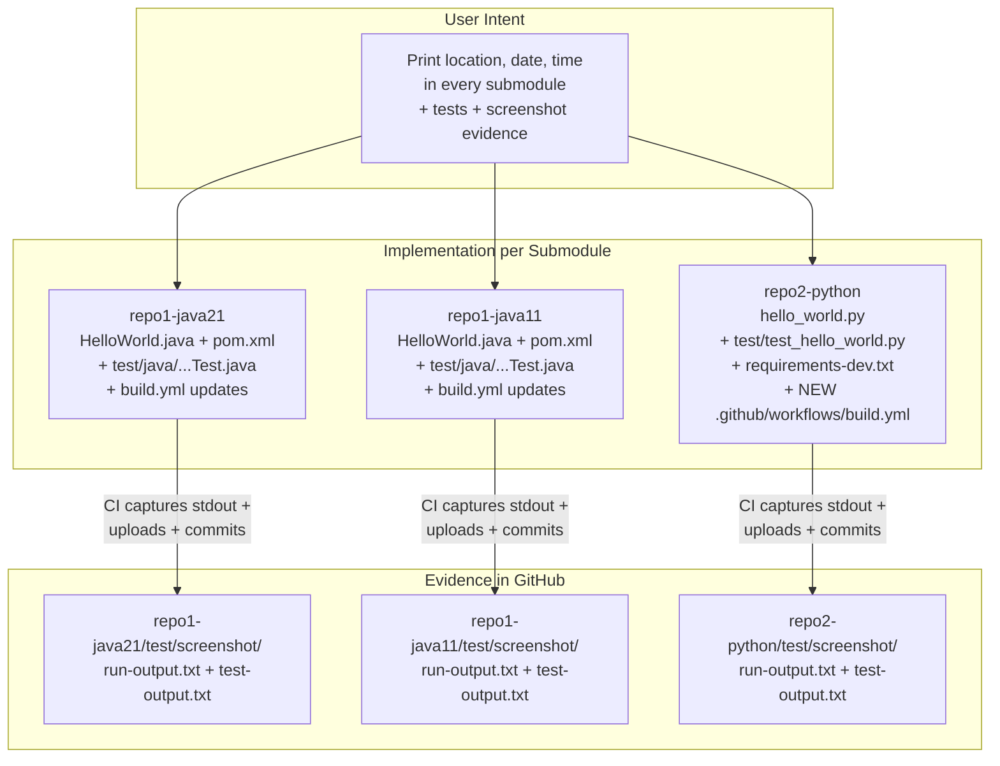

# Technical Specification

# 0. Agent Action Plan

## 0.1 Intent Clarification

### 0.1.1 Core Feature Objective

Based on the prompt, the Blitzy platform understands that the new feature requirement is to **extend each of the three sample applications in this repository so that, when run, each application additionally prints the host's current location, the current date, and the current time to standard output, alongside the existing greeting banner output**. The feature is purely additive — it augments existing console output without removing or refactoring the greeting behavior.

The user's verbatim requirements, preserved exactly as provided:

- **User Requirement 1:** "Add a new feature which, when the application is run, will print the current location, date and time"
- **User Requirement 2:** "the new feature must be added to all the submodules in the source repo"
- **User Requirement 3:** "It should add proper testing and push the testing evidence in the GitHub under a test/screeenshot folder"
- **User Requirement 4:** "Test code should be organized in test/ folder"

Restated with technical precision, the feature requirements decompose into the following objectives:

| # | Requirement | Technical Decomposition |
|---|---|---|
| R1 | Print current location | Compute and emit the host machine's identifier (hostname) plus its filesystem context (working directory) and timezone identifier — all available from each language's standard library |
| R2 | Print current date | Compute and emit the current calendar date in an unambiguous, locale-independent format (ISO-8601 `YYYY-MM-DD`) |
| R3 | Print current time | Compute and emit the current wall-clock time in `HH:MM:SS` format with the system timezone offset |
| R4 | Apply to all submodules | Implement the feature in each of the three submodules — `repo1-java21`, `repo1-java11`, `repo2-python` — using each submodule's own language idioms |
| R5 | Proper testing | Add automated unit tests that verify the new feature emits the expected fields in the expected format |
| R6 | Test code in `test/` | Place all test sources literally under a `test/` directory at each submodule's root (overrides Maven's default `src/test/` convention for the Java submodules) |
| R7 | Push test evidence to GitHub under `test/screenshot/` | Capture each test/CI run's stdout output as artifact files under each submodule's `test/screenshot/` directory and persist them to the GitHub-hosted remote |

#### 0.1.1.1 Implicit Requirements and Hidden Dependencies

The Blitzy platform identified the following implicit requirements not explicitly stated by the user but necessary for a coherent implementation:

- **Backward compatibility:** The existing console output — the ASCII banner, four multilingual greetings, and the `Runtime.version()` / `sys.version` line — must continue to be produced. The current behavior is documented in <cite index="">each submodule's README.md</cite> as the "Expected Output" and removing it would break the existing contract `[repo1-java21/README.md:L34-L44]` `[repo1-java11/README.md:L30-L40]` `[repo2-python/README.md:L22-L24]`.
- **Zero new runtime dependencies for the feature itself:** The current implementations are strictly standard-library only `[repo1-java21/src/main/java/com/example/HelloWorld.java:L1]` `[repo2-python/hello_world.py:L10-L11]`. To preserve this posture, the location/date/time feature must use only standard-library APIs (`java.net.InetAddress`, `java.time.*`, `socket`, `datetime`, `zoneinfo`, `os`).
- **New test-tier dependencies:** Tests must be added, which require JUnit 5 (Java) and pytest (Python). The current POMs declare no `<dependencies>` section `[repo1-java21/pom.xml:L1-L78]` `[repo1-java11/pom.xml:L1-L78]`, and the Python submodule has no dependency manifest at all — these manifests must be extended/created.
- **Maven test runner addition:** The current Java POMs declare three build plugins (enforcer, compiler, jar) but **no `maven-surefire-plugin`** `[repo1-java21/pom.xml:L26-L75]` `[repo1-java11/pom.xml:L26-L75]`. Surefire must be added to actually execute the new tests during `mvn test`.
- **`testSourceDirectory` override for Java:** Maven's convention places tests at `src/test/java/`. Because the user explicitly mandates `test/` at the submodule root, each Java POM must add `<testSourceDirectory>test/java</testSourceDirectory>` to the `<build>` section so Surefire picks up the user-specified location.
- **Python CI workflow is missing today:** `repo2-python/` contains no `.github/` directory at all `[inferred — confirmed via folder inspection]` `[tech-spec:§5.2.4.2]`. To satisfy "push the testing evidence in the GitHub under a test/screenshot folder", a brand-new GitHub Actions workflow must be created for the Python submodule.
- **Screenshot-evidence persistence mechanism:** The phrase "push the testing evidence in the GitHub" implies that screenshot artifacts must reach the GitHub-hosted remote. Two valid paths exist: (a) `actions/upload-artifact@v4` (downloadable from the workflow run) and (b) a workflow step that commits the captured files into `test/screenshot/` and pushes back to the branch. The plan adopts BOTH for maximum compatibility — artifacts are uploaded AND a commit-back step persists the files into the `test/screenshot/` folder on the branch.
- **"Screenshot" semantics for CLI applications:** None of the three samples have a graphical UI. The pragmatic interpretation of "screenshot" for a CLI application is the captured standard-output text rendered as evidence. The primary evidence file format is plain `.txt` capturing stdout; an optional secondary step can render the captured output to PNG via `aha` + ImageMagick for visual conformance.
- **Date/time formatting consistency across languages:** To make per-submodule output diffable (consistent with the existing "Multilingual Console Output Parity" feature F-011 documented in `[tech-spec:§2.1.5]`), all three implementations adopt the same date/time format string `yyyy-MM-dd HH:mm:ss zzz`.
- **`.gitignore` does not currently exclude `test/`:** The existing `.gitignore` files for the three submodules exclude only build outputs (`target/`, `__pycache__/`, etc.) and IDE files `[repo1-java21/.gitignore]` `[repo2-python/.gitignore]`. The new `test/` directories and their contents will not be ignored, so they will be tracked by Git as expected.

#### 0.1.1.2 Feature Dependencies and Prerequisites

| Prerequisite | Why It Matters |
|---|---|
| Each submodule remains independently buildable | The repository is a multi-submodule fixture (`[/.gitmodules:L1-L13]`); the feature must be added per-submodule without coupling them |
| Java 11 source must remain Java 11-compatible | `[repo1-java11/pom.xml:L40-L42]` enforces `requireJavaVersion [11,)`; the new code can use only Java 11-available APIs (`java.time.*` available since Java 8, `InetAddress` since Java 1.0 — all safe) |
| Java 21 source may use modern syntax | `[repo1-java21/pom.xml:L40-L42]` permits Java 21 features (records, text blocks, pattern matching) — the Java 21 implementation may continue to use them, but is not required to |
| Python source must remain Python 3.10+ compatible | `[repo2-python/README.md:L14]` declares the 3.10+ minimum; `zoneinfo` is standard library since 3.9 — safe |
| GitHub Actions workflow must remain triggered on push/PR | `[repo1-java21/.github/workflows/build.yml:L3-L7]` defines the existing trigger contract; the updated workflows must preserve it |

### 0.1.2 Special Instructions and Constraints

The Blitzy platform interpreted the user's special instructions as follows. The verbatim wording is preserved alongside its technical implication.

| User Directive (verbatim) | Technical Implication |
|---|---|
| "the new feature must be added to all the submodules in the source repo" | The feature must be implemented **three times** — once per submodule — in each submodule's native language (Java 21, Java 11, Python 3.10+). Implementations must be functionally equivalent so they can be diffed for parity, consistent with the existing F-011 contract `[tech-spec:§2.1.5]` |
| "Test code should be organized in test/ folder" | All test sources MUST live under a literal `test/` directory at the submodule root. For Java this overrides Maven's default of `src/test/`; each Java POM must declare `<testSourceDirectory>test/java</testSourceDirectory>`. For Python the `test/` directory is a normal pytest discovery root |
| "push the testing evidence in the GitHub under a test/screeenshot folder" | The captured stdout/test output artifacts MUST be persisted under each submodule's `test/screenshot/` directory in the GitHub-hosted repository. This requires both (a) CI artifact upload via `actions/upload-artifact@v4` and (b) an optional CI step that commits the evidence files back into `test/screenshot/` on the branch with `permissions: contents: write` |

**Architectural constraints inherited from the existing system:**

- **No application frameworks may be introduced.** Per `[tech-spec:§3.3.1]`, the repository deliberately omits Spring Boot, Flask, Django, Express, and similar — all programs perform stdout-only console I/O. The feature must continue that posture.
- **Maven plugin pinning convention must be honored.** Per `[tech-spec:§3.3.3]`, plugin versions are explicitly pinned (`maven-enforcer-plugin` 3.4.1, `maven-compiler-plugin` 3.12.1, `maven-jar-plugin` 3.3.0). Any new plugin (Surefire) must also be explicitly version-pinned to satisfy this convention.
- **UTF-8 source encoding must be preserved.** Per `[repo1-java21/pom.xml:L23]` `[repo1-java11/pom.xml:L23]`, `<project.build.sourceEncoding>UTF-8</project.build.sourceEncoding>` is declared. New test sources must also be UTF-8.
- **Identical Maven coordinates between Java submodules must be preserved.** Per `[tech-spec:§5.2.3.3]`, both Java POMs declare `com.example:hello-world-java:1.0.0`. This co-installation constraint is acknowledged but out of scope for this feature addition.

**Web search requirements:** No external web research is required to implement this feature. All needed APIs are part of well-established standard libraries (Java `java.time` since Java 8 / `InetAddress` since Java 1.0; Python `datetime`/`zoneinfo`/`socket`/`os`). All needed test frameworks (JUnit 5, pytest) are mature, widely documented standards. No external services, no third-party SDKs, and no design references are involved.

### 0.1.3 Technical Interpretation

These feature requirements translate to the following technical implementation strategy.

To implement the location/date/time feature in each submodule, the Blitzy platform will introduce a small helper routine in each existing entry point file that gathers three values from the standard library — hostname, working directory, and current local datetime with timezone — and prints them as additional lines after the existing greetings loop. The helper invocation will be placed **before** the existing `Runtime.version()` / `sys.version` line so the runtime-version line continues to be the final line of output, preserving the existing "Multilingual Console Output Parity" contract F-011 `[tech-spec:§2.1.5]`.

The mapping from each user requirement to its technical action is:

| Requirement | Component(s) Affected | Technical Action |
|---|---|---|
| R1 (location) | All three entry points | Add `printRuntimeContext()` (Java) / `print_runtime_context()` (Python) that prints `Host: <hostname>`, `Working directory: <cwd>`, `Timezone: <zone-id>` |
| R2 (date) | All three entry points | Print `Date: YYYY-MM-DD` derived from `LocalDate.now()` (Java) / `datetime.now().date()` (Python), formatted via `DateTimeFormatter.ISO_LOCAL_DATE` / `isoformat()` |
| R3 (time) | All three entry points | Print `Time: HH:MM:SS <zone-offset>` derived from `LocalTime.now()` / `datetime.now().time()` |
| R4 (all submodules) | `repo1-java21`, `repo1-java11`, `repo2-python` | Implement R1-R3 in each submodule using language-idiomatic patterns: records + text blocks where available (Java 21), classic classes (Java 11), f-strings + match (Python) |
| R5 (testing) | All three submodules | Add JUnit 5 test (Java) / pytest test (Python) that captures stdout, runs `main`, and asserts the presence of `Host:`, `Date:`, `Time:` markers along with a regex check on date/time format |
| R6 (`test/` folder) | Each submodule | Create `test/java/com/example/HelloWorldFeatureTest.java` (Java) / `test/test_hello_world.py` (Python); for Java, override Maven `<testSourceDirectory>` to point at `test/java` |
| R7 (evidence in `test/screenshot/`) | All three CI workflows | Add a CI step that runs the program after the tests and redirects stdout to `test/screenshot/run-output.txt`; add `actions/upload-artifact@v4` to publish the file; add a final step that commits-and-pushes the file back to the branch |

A high-level visualization of the implementation chain across the three submodules:




## 0.2 Repository Scope Discovery

### 0.2.1 Comprehensive File Analysis

The repository is a parent Git project containing three submodule directories `[/.gitmodules:L1-L13]` `[/README.md:L1-L46]`. There is no application source at the parent root; all implementation lives inside the three submodules. The Blitzy platform exhaustively enumerated every file in the repository to determine which require modification, which require creation, and which are referenced for context only.

#### 0.2.1.1 Parent Repository Inventory

| Path | Type | Role | Modification |
|---|---|---|---|
| `/.gitmodules` | Submodule manifest | Declares 3 submodules with paths, URLs, branches | REFERENCE (out of scope to modify) |
| `/README.md` | Markdown | Parent-repo onboarding | UPDATE — append a brief note about the new feature spanning all submodules |

#### 0.2.1.2 `repo1-java21` Submodule Inventory

| Path | Type | Current Role | Disposition |
|---|---|---|---|
| `repo1-java21/README.md` | Markdown | Build/run instructions, expected output `[L1-L62]` | UPDATE — extend "Expected Output" section; document the `test/` folder and `test/screenshot/` evidence convention |
| `repo1-java21/pom.xml` | Maven POM | Coordinates `com.example:hello-world-java:1.0.0`, plugins enforcer/compiler/jar `[L9-L73]` | UPDATE — add `<dependencies>` (JUnit Jupiter), add `<testSourceDirectory>test/java</testSourceDirectory>`, add `maven-surefire-plugin` 3.2.5 |
| `repo1-java21/.gitignore` | Git ignore | Excludes `target/`, IDE files | REFERENCE — no change needed; `test/` is not ignored |
| `repo1-java21/.github/workflows/build.yml` | GitHub Actions | 4-step Build & Run workflow `[L1-L28]` | UPDATE — add `mvn test` step, screenshot-capture step, artifact upload, and optional commit-back step |
| `repo1-java21/src/main/java/com/example/HelloWorld.java` | Java source | Entry point with greetings + `Runtime.version()` `[L11-L48]` | UPDATE — add `printRuntimeContext()` private method; invoke after greetings loop, before the runtime-version line |

#### 0.2.1.3 `repo1-java11` Submodule Inventory

| Path | Type | Current Role | Disposition |
|---|---|---|---|
| `repo1-java11/README.md` | Markdown | Build/run instructions `[L1-L58]` | UPDATE — extend "Expected Output" section; document `test/` and `test/screenshot/` |
| `repo1-java11/pom.xml` | Maven POM | Same plugins as Java 21 `[L9-L73]` | UPDATE — add JUnit dependency, `<testSourceDirectory>test/java</testSourceDirectory>`, `maven-surefire-plugin` 3.2.5 |
| `repo1-java11/.gitignore` | Git ignore | Same as Java 21 | REFERENCE |
| `repo1-java11/.github/workflows/build.yml` | GitHub Actions | Byte-identical to Java 21 workflow `[L1-L28]` | UPDATE — same modifications as Java 21 workflow |
| `repo1-java11/src/main/java/com/example/HelloWorld.java` | Java source | Entry point + static `Greeting` class `[L11-L73]` | UPDATE — add `printRuntimeContext()` method (using Java 11-compatible idioms only) |

#### 0.2.1.4 `repo2-python` Submodule Inventory

| Path | Type | Current Role | Disposition |
|---|---|---|---|
| `repo2-python/README.md` | Markdown | Run instructions, feature list `[L1-L24]` | UPDATE — extend "Output" section; document `test/` and `test/screenshot/` |
| `repo2-python/hello_world.py` | Python source | Entry script with `Greeting` dataclass and `main()` `[L14-L57]` | UPDATE — add `print_runtime_context()` function; invoke from `main()` after greetings loop, before the `sys.version` line |
| `repo2-python/.gitignore` | Git ignore | Excludes `__pycache__/`, virtualenvs | REFERENCE — no change needed; `test/` is not ignored |
| `repo2-python/.github/` | Directory | **DOES NOT EXIST** today | CREATE — entire `.github/workflows/` tree must be added |

#### 0.2.1.5 Integration Point Discovery

The Blitzy platform identified the following integration points across the repository. Each must be touched by the implementation.

| Integration Point | Location | Role in Feature |
|---|---|---|
| Java 21 program entry method | `repo1-java21/src/main/java/com/example/HelloWorld.java` → `main(String[] args)` at `[L16]` | Insertion site for `printRuntimeContext()` invocation |
| Java 11 program entry method | `repo1-java11/src/main/java/com/example/HelloWorld.java` → `main(String[] args)` at `[L32]` | Insertion site for `printRuntimeContext()` invocation |
| Python program entry function | `repo2-python/hello_world.py` → `main()` at `[L21]` | Insertion site for `print_runtime_context()` invocation |
| Java 21 Maven build descriptor | `repo1-java21/pom.xml` → `<build><plugins>` at `[L26-L75]` | Site for `maven-surefire-plugin` addition; `<testSourceDirectory>` injection at `<build>` level |
| Java 11 Maven build descriptor | `repo1-java11/pom.xml` → same `<build><plugins>` structure `[L26-L75]` | Same as Java 21 POM |
| Java 21 CI workflow | `repo1-java21/.github/workflows/build.yml` → `steps:` list `[L13-L28]` | Insertion site for `mvn test`, screenshot capture, artifact upload, commit-back |
| Java 11 CI workflow | `repo1-java11/.github/workflows/build.yml` → same `steps:` `[L13-L28]` | Same as Java 21 workflow |
| Python CI workflow | `repo2-python/.github/workflows/build.yml` → **MUST BE CREATED** | New workflow with checkout, setup-python, pytest, screenshot capture, artifact upload, commit-back |

There are no database models, no REST controllers, no middleware, no dependency injection containers, no message handlers, no service classes, and no API routes in this repository `[tech-spec:§5.1.1.2]` `[tech-spec:§6.1.2.2]`. The integration footprint is therefore confined to three program entry points, two build descriptors, three CI workflows, and four READMEs.

### 0.2.2 Web Search Research Conducted

No external web research is required for this feature. The implementation relies entirely on well-established standard libraries and mainstream test frameworks whose APIs are stable across major versions. Specifically:

- **Java standard library:** `java.net.InetAddress.getLocalHost().getHostName()`, `java.time.LocalDateTime.now()`, `java.time.format.DateTimeFormatter.ofPattern()`, `java.time.ZoneId.systemDefault()` — all available since Java 8 (well within both Java 11 and Java 21 baselines)
- **Python standard library:** `socket.gethostname()`, `os.getcwd()`, `datetime.datetime.now()`, `datetime.datetime.now().astimezone()`, `zoneinfo.ZoneInfo` — all available since Python 3.9 (within the 3.10+ baseline)
- **JUnit 5 (Jupiter):** Well-known test framework; using stable version 5.10.2; standard pattern for stdout capture (`System.setOut(new PrintStream(ByteArrayOutputStream))`) is widely documented
- **Maven Surefire Plugin:** Standard Maven test runner; version 3.2.5 provides native JUnit 5 support without an additional `surefire-junit-platform` artifact (built-in since 3.0)
- **pytest:** Well-known Python test framework; version 8.3.4 provides the `capsys` fixture for stdout capture
- **GitHub Actions actions used:** `actions/checkout@v4` and `actions/setup-java@v4` are already in use `[repo1-java21/.github/workflows/build.yml:L15-L22]`; `actions/setup-python@v5` and `actions/upload-artifact@v4` are standard marketplace actions

### 0.2.3 New File Requirements

The following files MUST be created. Each is listed with its absolute path within the repository, its purpose, and the submodule it belongs to.

#### 0.2.3.1 New Source Files (No New Application Source Files Required)

No new source files are required for the **application code itself** — the feature is added inline to the existing entry-point files.

#### 0.2.3.2 New Test Files

| Path | Submodule | Purpose |
|---|---|---|
| `repo1-java21/test/java/com/example/HelloWorldFeatureTest.java` | Java 21 | JUnit 5 test class capturing stdout from `HelloWorld.main(new String[]{})`; asserts that output contains `Host:`, `Date:`, `Time:` markers; asserts date matches `\d{4}-\d{2}-\d{2}` and time matches `\d{2}:\d{2}:\d{2}` |
| `repo1-java11/test/java/com/example/HelloWorldFeatureTest.java` | Java 11 | Same contract as Java 21 test, but written in Java 11-compatible idioms |
| `repo2-python/test/__init__.py` | Python | Empty package marker enabling pytest discovery |
| `repo2-python/test/test_hello_world.py` | Python | pytest module using `capsys` fixture; calls `hello_world.main()`; asserts the same markers and regex patterns |

#### 0.2.3.3 New Configuration and Dependency Files

| Path | Submodule | Purpose |
|---|---|---|
| `repo2-python/requirements-dev.txt` | Python | Declares `pytest==8.3.4` as a development-only dependency for test execution |

#### 0.2.3.4 New CI Workflow Files

| Path | Submodule | Purpose |
|---|---|---|
| `repo2-python/.github/workflows/build.yml` | Python | Brand-new GitHub Actions workflow (none exists today): checkout → setup-python 3.10 → install dev deps → pytest → capture screenshot → upload-artifact → optional commit-back |

#### 0.2.3.5 New Evidence Directory Markers

GitHub does not track empty directories, so each `test/screenshot/` directory needs a `.gitkeep` placeholder to ensure the directory exists in the repository before CI populates it.

| Path | Submodule | Purpose |
|---|---|---|
| `repo1-java21/test/screenshot/.gitkeep` | Java 21 | Placeholder so `test/screenshot/` directory is tracked by Git |
| `repo1-java11/test/screenshot/.gitkeep` | Java 11 | Same as above |
| `repo2-python/test/screenshot/.gitkeep` | Python | Same as above |
| `repo1-java21/test/screenshot/run-output.txt` | Java 21 | CI-generated; captured stdout from running the Java 21 JAR (populated and committed back by workflow) |
| `repo1-java21/test/screenshot/test-output.txt` | Java 21 | CI-generated; captured stdout from `mvn test` (populated and committed back by workflow) |
| `repo1-java11/test/screenshot/run-output.txt` | Java 11 | CI-generated; same as Java 21 |
| `repo1-java11/test/screenshot/test-output.txt` | Java 11 | CI-generated; same as Java 21 |
| `repo2-python/test/screenshot/run-output.txt` | Python | CI-generated; captured stdout from `python hello_world.py` |
| `repo2-python/test/screenshot/test-output.txt` | Python | CI-generated; captured stdout from `pytest` |


## 0.3 Dependency Inventory and Integration Analysis

### 0.3.1 Package Updates

The feature itself uses only standard-library facilities and introduces zero new application-runtime dependencies. New dependencies are introduced **only** for the testing tier and are scoped accordingly: Java JUnit artifacts use Maven scope `test`, and Python `pytest` is declared as a development-only requirement in a separate `requirements-dev.txt`. The existing three Java build plugins (enforcer, compiler, jar) remain unchanged at their currently pinned versions `[repo1-java21/pom.xml:L29-L73]`.

#### 0.3.1.1 New Dependencies — Java Submodules

| Registry | Package (groupId:artifactId) | Version | Scope | Purpose |
|---|---|---|---|---|
| Maven Central | `org.junit.jupiter:junit-jupiter-api` | 5.10.2 | `test` | JUnit 5 assertion and lifecycle API used by `HelloWorldFeatureTest.java` |
| Maven Central | `org.junit.jupiter:junit-jupiter-engine` | 5.10.2 | `test` | JUnit 5 platform engine that Surefire delegates to for test execution |
| Maven Central | `org.apache.maven.plugins:maven-surefire-plugin` | 3.2.5 | `build/plugin` | Maven test runner invoked by `mvn test`; natively supports JUnit 5 since Surefire 3.0 |

Why these versions: JUnit Jupiter 5.10.2 is a stable, widely-adopted release that supports both the Java 11 and Java 21 toolchains used in this repository. Surefire 3.2.5 provides native JUnit 5 platform discovery without requiring the legacy `junit-platform-surefire-provider` shim. All three coordinates are resolvable from Maven Central, which both Java POMs already implicitly consume via the existing pinned plugins.

#### 0.3.1.2 New Dependencies — Python Submodule

| Registry | Package | Version | Scope | Purpose |
|---|---|---|---|---|
| PyPI | `pytest` | 8.3.4 | dev / `requirements-dev.txt` | Test framework used by `test/test_hello_world.py`; provides the `capsys` fixture for stdout capture |

Why this version: `pytest` 8.3.4 is a stable release supporting Python 3.10+ which matches the submodule's declared minimum `[repo2-python/README.md:L14]`. The package is declared in a new `requirements-dev.txt` so it remains separable from any future runtime requirements file; the application itself continues to declare no runtime dependencies, preserving the standard-library-only posture documented in `[tech-spec:§3.3.5]`.

### 0.3.2 Dependency Updates

#### 0.3.2.1 Import Updates

The new feature introduces additional imports in the three entry-point files. No existing imports require modification or removal.

**`repo1-java21/src/main/java/com/example/HelloWorld.java`** — add to the existing import block (currently empty above the class declaration `[L1]`):

```java
import java.net.InetAddress;
import java.time.LocalDateTime;
import java.time.ZoneId;
import java.time.format.DateTimeFormatter;
```

**`repo1-java11/src/main/java/com/example/HelloWorld.java`** — same four imports as Java 21:

```java
import java.net.InetAddress;
import java.time.LocalDateTime;
import java.time.ZoneId;
import java.time.format.DateTimeFormatter;
```

**`repo2-python/hello_world.py`** — add to the existing import block `[L10-L11]`:

```python
import os
import socket
from datetime import datetime
from zoneinfo import ZoneInfo  # Python 3.9+; safe under the 3.10+ baseline
```

#### 0.3.2.2 External Reference Updates

The following configuration and documentation files require updates as ripple effects of the dependency and structural changes.

| File pattern | Reason for update |
|---|---|
| `repo1-java21/pom.xml`, `repo1-java11/pom.xml` | Add `<dependencies>` section with JUnit Jupiter API + Engine (test scope); add `<testSourceDirectory>test/java</testSourceDirectory>` inside `<build>`; add `maven-surefire-plugin` to `<plugins>` |
| `repo1-java21/.github/workflows/build.yml`, `repo1-java11/.github/workflows/build.yml` | Add `mvn test` step before `mvn package`; add screenshot-capture step (`java -jar ... > test/screenshot/run-output.txt 2>&1`); add `actions/upload-artifact@v4` step; add optional commit-back step with `permissions: contents: write` |
| `repo2-python/.github/workflows/build.yml` (NEW) | Brand-new file: trigger on push and PR; checkout; `actions/setup-python@v5` with 3.10; `pip install -r requirements-dev.txt`; `pytest`; capture stdout; upload-artifact; optional commit-back |
| `repo2-python/requirements-dev.txt` (NEW) | Brand-new dev manifest declaring `pytest==8.3.4` |
| All four `README.md` files (root + 3 submodules) | Document the new feature, the `test/` and `test/screenshot/` directories, and the updated expected output |

### 0.3.3 Existing Code Touchpoints

The Blitzy platform identified the following direct modification points in existing code. Each is grounded in a specific source location.

#### 0.3.3.1 Direct Application Code Modifications

| File | Touchpoint | Modification |
|---|---|---|
| `repo1-java21/src/main/java/com/example/HelloWorld.java` | `main(String[] args)` body, after the greetings `for` loop `[L35-L44]` and before the `Runtime.version()` line `[L46]` | Insert `printRuntimeContext();` call; add the `printRuntimeContext()` static method to the class |
| `repo1-java11/src/main/java/com/example/HelloWorld.java` | `main(String[] args)` body, after the greetings `for` loop `[L50-L70]` and before the `Runtime.version()` line `[L72]` | Insert `printRuntimeContext();` call; add the `printRuntimeContext()` static method to the class |
| `repo2-python/hello_world.py` | `main()` body, after the greetings `for` loop `[L39-L51]` and before the `sys.version` line `[L53]` | Insert `print_runtime_context()` call; define the helper function above `main()` or just below imports |

#### 0.3.3.2 Build Descriptor Modifications

| File | Touchpoint | Modification |
|---|---|---|
| `repo1-java21/pom.xml` | Between `<properties>` `[L20-L24]` and `<build>` `[L26]` | Insert `<dependencies>` block with two JUnit Jupiter coordinates at scope `test` |
| `repo1-java21/pom.xml` | Inside `<build>` element `[L26-L76]`, before `<plugins>` `[L27]` | Insert `<testSourceDirectory>test/java</testSourceDirectory>` |
| `repo1-java21/pom.xml` | Inside `<plugins>` `[L27-L74]`, after the existing `maven-jar-plugin` block `[L61-L73]` | Insert `<plugin>` declaration for `maven-surefire-plugin` 3.2.5 |
| `repo1-java11/pom.xml` | Same touchpoints as Java 21 POM (same line ranges) `[L20-L74]` | Identical three insertions as Java 21 POM |

#### 0.3.3.3 CI Workflow Modifications

| File | Touchpoint | Modification |
|---|---|---|
| `repo1-java21/.github/workflows/build.yml` | Top of file `[L1-L8]` | Add `permissions: contents: write` block to allow the commit-back step |
| `repo1-java21/.github/workflows/build.yml` | After the `Build with Maven` step `[L24-L25]` and before the `Run JAR` step `[L27-L28]` | Add a `Run unit tests` step: `mvn --no-transfer-progress test`; add `Capture test stdout` step that tees output to `test/screenshot/test-output.txt` |
| `repo1-java21/.github/workflows/build.yml` | After the `Run JAR` step `[L27-L28]` | Modify the `Run JAR` step to redirect stdout to `test/screenshot/run-output.txt`; add `actions/upload-artifact@v4` step that uploads `test/screenshot/**` as a workflow artifact; add a final step that runs `git add test/screenshot/ && git commit -m "ci: persist screenshot evidence" && git push` with the runner token |
| `repo1-java11/.github/workflows/build.yml` | Same touchpoints as Java 21 workflow | Identical modifications |
| `repo2-python/.github/workflows/build.yml` | **File does not exist — must be created** | Full workflow definition (see §0.4.2.4) |

#### 0.3.3.4 Database, Schema, and Service-Container Touchpoints

There are **none**. Per `[tech-spec:§3.6.1]` and `[tech-spec:§6.2]`, the repository contains no databases, persistence layers, service containers, dependency-injection wirings, or migration scripts. The "no integration architecture" determination in `[tech-spec:§6.3]` likewise eliminates message-queue, REST, gRPC, and SOAP integration touchpoints.

#### 0.3.3.5 Cross-Submodule Coordination

The three submodule implementations are intentionally independent — each can be built, tested, and run on its own. The only coordination point is the **format consistency** of the new output lines: all three implementations emit lines using the prefixes `Host: `, `Working directory: `, `Timezone: `, `Date: `, and `Time: ` so that the captured screenshots can be visually compared across submodules, consistent with the existing F-011 "Multilingual Console Output Parity" contract `[tech-spec:§2.1.5]`.


## 0.4 Technical Implementation Design

### 0.4.1 File-by-File Execution Plan

Every file listed below MUST be created, modified, or deleted as indicated. The four groups correspond to the three submodules plus the parent repository.

#### 0.4.1.1 Group A — `repo1-java21` Submodule

| Mode | Path | Implementation |
|---|---|---|
| UPDATE | `repo1-java21/src/main/java/com/example/HelloWorld.java` | Add four new imports (`InetAddress`, `LocalDateTime`, `ZoneId`, `DateTimeFormatter`); insert `printRuntimeContext()` invocation in `main` after the greetings loop and before the `Runtime.version()` line `[L46]`; add a private static `printRuntimeContext()` method that prints `Host:`, `Working directory:`, `Timezone:`, `Date:`, and `Time:` lines using `InetAddress.getLocalHost().getHostName()`, `System.getProperty("user.dir")`, `ZoneId.systemDefault()`, and a `LocalDateTime.now().format(DateTimeFormatter.ofPattern("yyyy-MM-dd HH:mm:ss"))` split into date/time portions; wrap the `InetAddress` call in a defensive try/catch that falls back to `"unknown"` on `UnknownHostException` |
| UPDATE | `repo1-java21/pom.xml` | Insert `<dependencies>` block with `org.junit.jupiter:junit-jupiter-api:5.10.2` and `org.junit.jupiter:junit-jupiter-engine:5.10.2` (both scope `test`); insert `<testSourceDirectory>test/java</testSourceDirectory>` inside `<build>` immediately before `<plugins>`; insert a new `<plugin>` for `maven-surefire-plugin` 3.2.5 inside `<plugins>` after the existing `maven-jar-plugin` |
| UPDATE | `repo1-java21/.github/workflows/build.yml` | Add `permissions: contents: write` to the workflow root; add a `Run unit tests` step running `mvn --no-transfer-progress test \| tee test/screenshot/test-output.txt`; modify the existing `Run JAR` step to redirect stdout to `test/screenshot/run-output.txt`; add an `actions/upload-artifact@v4` step uploading `test/screenshot/**`; add a final step that commits and pushes `test/screenshot/` back to the branch using `${{ github.token }}` |
| UPDATE | `repo1-java21/README.md` | Append "Testing" section documenting `mvn test`, the `test/` folder layout, and the `test/screenshot/` evidence convention; update "Expected Output" to show the new location/date/time lines |
| CREATE | `repo1-java21/test/java/com/example/HelloWorldFeatureTest.java` | JUnit 5 test class; uses `@BeforeEach`/`@AfterEach` to swap `System.out` with a `PrintStream` wrapping a `ByteArrayOutputStream`; `@Test` method `printsHostDateAndTime()` calls `HelloWorld.main(new String[]{})` and asserts the captured output contains `"Host:"`, `"Working directory:"`, `"Timezone:"`, matches `Date: \d{4}-\d{2}-\d{2}` and `Time: \d{2}:\d{2}:\d{2}` regexes |
| CREATE | `repo1-java21/test/screenshot/.gitkeep` | Empty file ensuring the directory is tracked by Git |
| CREATE (CI-generated) | `repo1-java21/test/screenshot/run-output.txt` | Captured stdout from `java -jar target/hello-world.jar`; populated and committed by CI on each green workflow run |
| CREATE (CI-generated) | `repo1-java21/test/screenshot/test-output.txt` | Captured stdout from `mvn test`; populated and committed by CI on each green workflow run |

#### 0.4.1.2 Group B — `repo1-java11` Submodule

| Mode | Path | Implementation |
|---|---|---|
| UPDATE | `repo1-java11/src/main/java/com/example/HelloWorld.java` | Same four imports as Java 21 (all available since Java 8); insert `printRuntimeContext()` call after the greetings loop and before the `Runtime.version()` line `[L72]`; add a static `printRuntimeContext()` method using Java 11-compatible idioms (no text blocks, no `var`, no pattern-matching switch) — explicit `String` concatenation and traditional method invocations |
| UPDATE | `repo1-java11/pom.xml` | Identical updates to the Java 21 POM: `<dependencies>` with JUnit Jupiter (scope `test`); `<testSourceDirectory>test/java</testSourceDirectory>`; `maven-surefire-plugin` 3.2.5 |
| UPDATE | `repo1-java11/.github/workflows/build.yml` | Identical updates to the Java 21 workflow |
| UPDATE | `repo1-java11/README.md` | Append "Testing" section; update "Expected Output" |
| CREATE | `repo1-java11/test/java/com/example/HelloWorldFeatureTest.java` | JUnit 5 test class with the same assertion contract as the Java 21 test, written in Java 11-compatible style |
| CREATE | `repo1-java11/test/screenshot/.gitkeep` | Directory marker |
| CREATE (CI-generated) | `repo1-java11/test/screenshot/run-output.txt` | Captured run output |
| CREATE (CI-generated) | `repo1-java11/test/screenshot/test-output.txt` | Captured test output |

#### 0.4.1.3 Group C — `repo2-python` Submodule

| Mode | Path | Implementation |
|---|---|---|
| UPDATE | `repo2-python/hello_world.py` | Add imports: `import os`, `import socket`, `from datetime import datetime`, `from zoneinfo import ZoneInfo`; define `print_runtime_context()` function above `main()`; call `print_runtime_context()` inside `main()` after the greetings `for` loop `[L51]` and before the `sys.version` line `[L53]` |
| UPDATE | `repo2-python/README.md` | Append "Testing" section documenting `pip install -r requirements-dev.txt` and `pytest`; document the `test/` and `test/screenshot/` layout; update "Output" to mention new lines |
| CREATE | `repo2-python/requirements-dev.txt` | Single line: `pytest==8.3.4` |
| CREATE | `repo2-python/test/__init__.py` | Empty package marker for pytest discovery |
| CREATE | `repo2-python/test/test_hello_world.py` | pytest module with `test_prints_host_date_and_time(capsys)` that invokes `hello_world.main()` (via `import hello_world`), reads `capsys.readouterr().out`, and asserts the same markers and regex patterns as the Java tests |
| CREATE | `repo2-python/test/screenshot/.gitkeep` | Directory marker |
| CREATE | `repo2-python/.github/workflows/build.yml` | Brand-new GitHub Actions workflow — see §0.4.2.4 for full skeleton |
| CREATE (CI-generated) | `repo2-python/test/screenshot/run-output.txt` | Captured run output |
| CREATE (CI-generated) | `repo2-python/test/screenshot/test-output.txt` | Captured test output |

#### 0.4.1.4 Group D — Parent Repository

| Mode | Path | Implementation |
|---|---|---|
| UPDATE | `/README.md` | Append a brief note under "Submodules" indicating that each submodule now also prints current location/date/time when executed, and that test evidence is persisted under each submodule's `test/screenshot/` directory |

### 0.4.2 Implementation Approach per File

This section describes the concrete edit pattern for each non-trivial file. Code fragments are kept intentionally brief; they are illustrative skeletons rather than full implementations.

#### 0.4.2.1 Java Entry Points (`HelloWorld.java` — Both Variants)

Approach for `repo1-java21/src/main/java/com/example/HelloWorld.java`:

```java
private static void printRuntimeContext() {
    String host;
    try { host = InetAddress.getLocalHost().getHostName(); }
    catch (Exception e) { host = "unknown"; }
    // emit Host, Working directory, Timezone, Date, Time lines using ZoneId.systemDefault()
}
```

Approach for `repo1-java11/src/main/java/com/example/HelloWorld.java`: structurally identical, but every construct must be Java 11-compatible — explicit `String` concatenation instead of text blocks, no `var`, traditional control flow. The same `java.time` and `java.net.InetAddress` APIs are used; both have been available since Java 8 / 1.0 respectively, which is comfortably below the Java 11 baseline `[repo1-java11/pom.xml:L40-L42]`.

Invocation in `main` (both variants) occurs after the greetings loop and before the existing `System.out.println("\nRunning on: " + Runtime.version());` line — preserving F-011 parity by keeping the runtime-version line as the final output line.

#### 0.4.2.2 Python Entry Point (`hello_world.py`)

Approach:

```python
def print_runtime_context() -> None:
    now = datetime.now().astimezone()
    # emit Host, Working directory, Timezone, Date (now.date().isoformat()), Time (now.strftime("%H:%M:%S"))
```

Invocation in `main()` occurs after the greetings `for` loop `[repo2-python/hello_world.py:L39-L51]` and before the `print(f"\nRunning on: Python {sys.version}")` line `[L53]`.

#### 0.4.2.3 Maven POM Updates

Approach for `repo1-java21/pom.xml` and `repo1-java11/pom.xml` — identical structural changes; only the JUnit version differs by zero (same `5.10.2` in both):

```xml
<dependencies>
    <dependency>
        <groupId>org.junit.jupiter</groupId>
        <artifactId>junit-jupiter-api</artifactId>
        <version>5.10.2</version>
        <scope>test</scope>
    </dependency>
</dependencies>
```

Within `<build>`, add `<testSourceDirectory>test/java</testSourceDirectory>` (required to honor the user's `test/` directive overriding Maven's default `src/test/java`), and add a new `<plugin>` block for `maven-surefire-plugin` version `3.2.5` (binds to the `test` phase; native JUnit 5 discovery requires no extra provider artifact).

#### 0.4.2.4 GitHub Actions Workflow Updates

**Existing Java workflows** (`repo1-java21/.github/workflows/build.yml` and `repo1-java11/.github/workflows/build.yml` — currently byte-identical 29-line files per `[tech-spec:§5.2.6.1]`): the new step sequence becomes Checkout → Setup-Java 21 → `mvn test` → `mvn package` → run JAR with stdout redirect → upload-artifact → commit-back. The workflow root adds `permissions: contents: write` to enable the final commit-back step.

**New Python workflow** (`repo2-python/.github/workflows/build.yml`): trigger on push (any branch) and PR to main — matching the existing Java workflows' trigger contract `[repo1-java21/.github/workflows/build.yml:L3-L7]`. Step sequence: `actions/checkout@v4` → `actions/setup-python@v5` with `python-version: '3.10'` → `pip install -r requirements-dev.txt` → `pytest test/ \| tee test/screenshot/test-output.txt` → `python hello_world.py > test/screenshot/run-output.txt 2>&1` → `actions/upload-artifact@v4` with path `test/screenshot/**` → commit-and-push step.

Workflow logical flow (applies to all three submodules):

```mermaid
flowchart TB
    Trigger([push or pull_request])
    Checkout[actions/checkout@v4]
    SetupRuntime[setup-java@v4 OR setup-python@v5]
    InstallDeps[mvn install/setup-java cache<br/>OR pip install requirements-dev.txt]
    Test[mvn test OR pytest<br/>tee output to test/screenshot/test-output.txt]
    Build[mvn package<br/>Java-only step]
    Run[java -jar target/hello-world.jar<br/>OR python hello_world.py<br/>redirect to test/screenshot/run-output.txt]
    Upload[actions/upload-artifact@v4<br/>path: test/screenshot/**]
    Commit[git add/commit/push<br/>test/screenshot/<br/>permissions: contents: write]
    Status[/GitHub status check posted/]

    Trigger --> Checkout --> SetupRuntime --> InstallDeps --> Test --> Build --> Run --> Upload --> Commit --> Status
    Build -.->|"skipped for<br/>Python"| Run
```

#### 0.4.2.5 Test File Implementations

**Java tests** (`HelloWorldFeatureTest.java` in both Java submodules):

```java
@Test
void printsHostDateAndTime() {
    HelloWorld.main(new String[]{});  // stdout captured via System.setOut in @BeforeEach
    String output = capturedStdout.toString();
    assertTrue(output.contains("Host:"));
    assertTrue(output.matches("(?s).*Date: \\d{4}-\\d{2}-\\d{2}.*"));
}
```

**Python test** (`test_hello_world.py`):

```python
def test_prints_host_date_and_time(capsys):
    hello_world.main()
    captured = capsys.readouterr().out
    assert "Host:" in captured
    assert re.search(r"Date: \d{4}-\d{2}-\d{2}", captured)
```

Both implementations test the SAME observable contract: the existence of `Host:`, `Working directory:`, `Timezone:`, `Date:`, `Time:` markers in stdout, plus regex conformance for the date and time formats.

#### 0.4.2.6 Screenshot Evidence Capture Mechanism

Because all three samples are CLI applications without any graphical UI, "screenshot" is interpreted pragmatically as the captured terminal output. The primary capture mechanism in CI is stdout/stderr redirection to plain `.txt` files inside each submodule's `test/screenshot/` directory. The mechanism has three layered persistence channels:

| Channel | Mechanism | Outcome |
|---|---|---|
| Local file on the runner | `command > test/screenshot/<name>.txt 2>&1` or `command \| tee test/screenshot/<name>.txt` | Files exist in the runner's working tree |
| GitHub workflow artifact | `actions/upload-artifact@v4` with `path: <submodule>/test/screenshot/**` | Files are downloadable from the workflow run page for 90 days (default retention) |
| Persistent commit | `git add test/screenshot/ && git commit -m "ci: persist screenshot evidence" && git push` with `permissions: contents: write` | Files are committed back into the `test/screenshot/` directory on the branch; this is the literal "push the testing evidence in the GitHub" persistence |

**Optional PNG screenshots:** If true PNG screenshot files are required (instead of `.txt`), an additional CI step can install `aha` (ANSI-to-HTML) and `wkhtmltoimage` (HTML-to-image) and convert each captured `.txt` to a `.png`, also stored under `test/screenshot/`. This is flagged as enhancement; the primary plan uses `.txt` for maximum portability and minimum runner-image dependency.

### 0.4.3 User Interface Design

**Not applicable.** All three sample applications are command-line programs whose entire user interface is `stdout` `[tech-spec:§7.3]`. The feature adds five additional output lines (Host, Working directory, Timezone, Date, Time) to the existing stdout sequence. There is no graphical UI, no terminal user interface (TUI), no HTML, no CSS, no front-end framework, no design system, and no Figma asset associated with this feature. The "User Interface Design" considerations enumerated in the section prompt — visual mockups, component libraries, design tokens, responsive behavior — have no referent in this codebase, consistent with the umbrella determination in `[tech-spec:§7]` that the system has no UI artifacts.

The only "UI" surface change is the order and format of stdout lines, summarized below for traceability:

| Sequence Position | Line Pattern | Source |
|---|---|---|
| 1 | ASCII banner (existing) | `[repo1-java21/src/main/java/com/example/HelloWorld.java:L19-L23]` and equivalents |
| 2 | Four multilingual greetings (existing) | `[L28-L44]` and equivalents |
| 3 | `Host: <hostname>` (NEW) | Inserted by `printRuntimeContext()` / `print_runtime_context()` |
| 4 | `Working directory: <cwd>` (NEW) | Same |
| 5 | `Timezone: <zone-id>` (NEW) | Same |
| 6 | `Date: YYYY-MM-DD` (NEW) | Same |
| 7 | `Time: HH:MM:SS` (NEW) | Same |
| 8 | `Running on: <runtime version>` (existing) | `[repo1-java21/src/main/java/com/example/HelloWorld.java:L46]` and equivalents |


## 0.5 Scope Boundaries

### 0.5.1 Exhaustively In Scope

The following enumerates every file group, with trailing wildcards where patterns apply, that is in scope for this feature addition. Every file listed below WILL be created, modified, or otherwise touched by the implementation.

#### 0.5.1.1 Application Source Files

- All Java application source files in both Java submodules — `repo1-java21/src/main/java/com/example/**/*.java`, `repo1-java11/src/main/java/com/example/**/*.java` (touchpoint: each `HelloWorld.java`)
- The Python application source file — `repo2-python/hello_world.py`

#### 0.5.1.2 Test Source Files (User-Mandated `test/` Folder)

- All Java test sources in both Java submodules — `repo1-java21/test/java/**/*.java`, `repo1-java11/test/java/**/*.java`
- All Python test sources — `repo2-python/test/**/*.py` (including `__init__.py` and `test_hello_world.py`)

#### 0.5.1.3 Test Evidence Files (User-Mandated `test/screenshot/` Folder)

- All evidence files in each submodule — `repo1-java21/test/screenshot/**`, `repo1-java11/test/screenshot/**`, `repo2-python/test/screenshot/**`
- `.gitkeep` placeholder per directory
- CI-generated `run-output.txt` and `test-output.txt` per submodule (populated and committed by the workflow)

#### 0.5.1.4 Build Descriptors and Dependency Manifests

- Java POMs — `repo1-java21/pom.xml`, `repo1-java11/pom.xml` (add `<dependencies>`, `<testSourceDirectory>`, `maven-surefire-plugin`)
- Python development manifest — `repo2-python/requirements-dev.txt` (NEW)

#### 0.5.1.5 CI/CD Workflow Files

- Existing Java workflows — `repo1-java21/.github/workflows/build.yml`, `repo1-java11/.github/workflows/build.yml` (modify to add test step, screenshot capture, artifact upload, commit-back)
- New Python workflow — `repo2-python/.github/workflows/build.yml` (CREATE; no equivalent exists today)

#### 0.5.1.6 Documentation Files

- Parent repository documentation — `/README.md` (append note about the new feature)
- Per-submodule documentation — `repo1-java21/README.md`, `repo1-java11/README.md`, `repo2-python/README.md` (append "Testing" section, update "Expected Output" / "Output")

#### 0.5.1.7 Files NOT Modified But In Scope For Reference

- `/.gitmodules` — read for submodule topology; not modified
- All three `.gitignore` files — verified to not exclude `test/`; not modified

### 0.5.2 Explicitly Out of Scope

The following items are NOT in scope for this feature addition. They are listed explicitly to prevent scope creep during implementation.

| Item | Rationale |
|---|---|
| Geo-IP / IP-geolocation services (MaxMind, IP-API, IPinfo, etc.) | Would add external runtime dependencies; the standard-library interpretation of "location" (hostname + working directory + timezone) is sufficient and preserves the zero-runtime-dependency posture documented in `[tech-spec:§3.4.1]` |
| Modification of `/.gitmodules` | Submodule topology is not affected by this feature |
| Maven coordinate disambiguation between the two Java submodules | The known co-installation constraint (`com.example:hello-world-java:1.0.0` declared identically in both POMs per `[tech-spec:§5.2.3.3]`) is acknowledged but unaffected by this feature |
| Changing the Java 11 workflow's JDK from 21 to 11 | The byte-identical-workflow choice (ADR-003) is preserved; the new feature uses only `java.time` and `InetAddress` APIs that work identically on JDK 11 and JDK 21 |
| Adding integration tests, end-to-end tests, performance tests, or security tests | The user requested "proper testing" — interpreted as unit-level tests that verify the new feature outputs the required fields; the system has no integration surfaces, no APIs, and no UI to test at higher tiers per `[tech-spec:§6.6.3]` and `[tech-spec:§6.6.4]` |
| Adding application logging, monitoring, or observability stack | The system is a CLI demonstration with stdout-only I/O per `[tech-spec:§5.4.2]`; no logging framework or APM agent is required for this feature |
| Adding any application framework (Spring Boot, Flask, Django, Express, FastAPI, etc.) | The repository deliberately omits frameworks per `[tech-spec:§3.3.1]`; the feature does not require a framework |
| Refactoring the greeting logic, banner content, or runtime-version line | The feature is purely additive — existing behavior is preserved verbatim to honor backward compatibility |
| Adding a containerization layer (Dockerfile, Compose) | No containerization exists per `[tech-spec:§8.4]`; not introduced by this feature |
| Adding any database, persistence layer, cache, or message broker | None exist per `[tech-spec:§3.6]` and `[tech-spec:§6.2]`; not introduced by this feature |
| Adding authentication, authorization, encryption, or secrets management | None exist per `[tech-spec:§6.4]`; not introduced by this feature |
| Modifying the upstream submodule repositories themselves | The feature modifies files at the paths the parent repo tracks; whether changes are pushed upstream into `Repo1_for_blitzy_submod_test` and `Repo2_for_blitzy_submod_test` is a separate Git operations concern handled outside this AAP |
| Migrating Maven build to Gradle or another build system | Maven 3.9+ remains the build tool per `[tech-spec:§3.3.2]` |
| Adding code coverage tooling (JaCoCo, coverage.py) | The user requested "proper testing" but did not request coverage thresholds; JaCoCo/coverage.py are not in scope unless explicitly added later |
| Adding static analysis or linting (SpotBugs, Checkstyle, Ruff, Pylint) | Not requested by the user; outside scope of this feature |
| Cross-submodule shared library or shared test utilities | Each submodule remains independently buildable per its existing self-contained design |


## 0.6 Rules for Feature Addition

### 0.6.1 User-Provided Rules

The user supplied an **empty** rules array (`User specified implementation rules for this project: []`). No formal rules were declared.

### 0.6.2 Feature-Specific Rules Derived From User Instructions

The following rules are derived from the user's prose requirements and from existing repository conventions. They MUST be honored by the implementation.

#### 0.6.2.1 Submodule Parity Rule

The feature MUST be implemented in all three submodules — `repo1-java21`, `repo1-java11`, and `repo2-python` — with **functionally equivalent observable output**. The five new output lines (`Host:`, `Working directory:`, `Timezone:`, `Date:`, `Time:`) MUST use identical line prefixes across all three implementations so that the captured screenshots are visually comparable. This preserves the F-011 "Multilingual Console Output Parity" contract documented in `[tech-spec:§2.1.5]`.

#### 0.6.2.2 `test/` Folder Rule (Literal Interpretation)

All test source code MUST be placed under a literal `test/` directory at each submodule's root — NOT under Maven's default `src/test/` convention. This rule is a direct quotation of the user's instruction: "Test code should be organized in test/ folder". For the Java submodules this requires injecting `<testSourceDirectory>test/java</testSourceDirectory>` into each `pom.xml` `<build>` section. For the Python submodule, `test/` is the pytest discovery root.

#### 0.6.2.3 Screenshot Evidence Persistence Rule

CI workflow runs MUST persist test evidence in the GitHub-hosted repository under each submodule's `test/screenshot/` directory. This rule is a direct quotation of the user's instruction: "push the testing evidence in the GitHub under a test/screeenshot folder". The implementation MUST employ at least one of the following persistence channels, and preferably both:

- `actions/upload-artifact@v4` to publish evidence as a downloadable workflow artifact, AND
- A workflow step using `permissions: contents: write` and `git add/commit/push` to commit the evidence files into `test/screenshot/` on the branch

#### 0.6.2.4 Standard-Library-Only Application Rule (Inherited Convention)

The new feature's runtime code path MUST use only standard-library APIs in each language. No third-party libraries may be introduced for the feature itself. This rule preserves the existing convention documented in `[tech-spec:§3.3.5]` (Python uses standard library only) and `[tech-spec:§3.4]` (Java uses no runtime dependencies). Test-tier dependencies (JUnit, pytest) are explicitly permitted as separate-scope additions and do not violate this rule.

#### 0.6.2.5 Backward-Compatibility Rule

Existing console output — banner, four greetings, and runtime-version line — MUST continue to be produced and in the same relative order, with the new feature lines inserted **after the greetings loop and before the runtime-version line**. This preserves the contract documented in each per-submodule README's "Expected Output" section `[repo1-java21/README.md:L34-L44]` `[repo1-java11/README.md:L30-L40]` `[repo2-python/README.md:L22-L24]`.

#### 0.6.2.6 Maven Plugin Version Pinning Rule (Inherited Convention)

Any newly added Maven plugin MUST be version-pinned to an explicit release. The new `maven-surefire-plugin` is pinned at `3.2.5`. This rule preserves the convention documented in `[tech-spec:§3.3.3]` where the existing three plugins are pinned at `maven-enforcer-plugin` 3.4.1, `maven-compiler-plugin` 3.12.1, and `maven-jar-plugin` 3.3.0.

#### 0.6.2.7 UTF-8 Encoding Rule (Inherited Convention)

All new source files (Java sources, Java tests, Python sources, Python tests) MUST be authored in UTF-8 encoding. The Java POMs already declare `<project.build.sourceEncoding>UTF-8</project.build.sourceEncoding>` `[repo1-java21/pom.xml:L23]` `[repo1-java11/pom.xml:L23]` which Surefire honors automatically; no additional configuration is required for the test sources.

#### 0.6.2.8 No Application Framework Rule (Inherited Convention)

No application framework (Spring Boot, Flask, Django, Express, FastAPI, etc.) may be introduced as part of this feature. This rule preserves the architectural posture documented in `[tech-spec:§3.3.1]`.

#### 0.6.2.9 Java Version Compatibility Rules

- Java 21 submodule (`repo1-java21`): the modified code may use any Java 21 language feature (records, text blocks, pattern matching, `var`)
- Java 11 submodule (`repo1-java11`): the modified code MUST use only Java 11-compatible idioms — no text blocks, no records, no pattern-matching switch, no `var`. The Maven Enforcer Plugin `[repo1-java11/pom.xml:L40-L42]` `requireJavaVersion [11,)` permits compilation on JDK 11 or later; the compiler `<release>11</release>` setting `[L56]` enforces the source-language level

#### 0.6.2.10 Python Version Compatibility Rule

The Python submodule MUST remain Python 3.10+ compatible per `[repo2-python/README.md:L14]`. The new APIs used (`socket.gethostname`, `os.getcwd`, `datetime.now`, `zoneinfo.ZoneInfo`) are all available since Python 3.9 — comfortably under the 3.10 baseline.

#### 0.6.2.11 CI Trigger Preservation Rule

The existing CI trigger contract — `on: push` to any branch and `on: pull_request` to `main` `[repo1-java21/.github/workflows/build.yml:L3-L7]` — MUST be preserved in the modified Java workflows. The new Python workflow MUST adopt the same trigger contract for consistency.

#### 0.6.2.12 No Modification of `.gitmodules` Rule

The `.gitmodules` manifest MUST NOT be modified by this feature. Submodule topology, upstream URLs, and tracked branches remain exactly as declared `[/.gitmodules:L1-L13]`. This rule prevents accidental side-effects on the parent's orchestration contract documented as F-001 in `[tech-spec:§2.1.1]`.


## 0.7 References

### 0.7.1 Inline Citation Index

Every claim about the existing system in subsections 0.1 through 0.6 is grounded in one of the following sources. Citations in the body of this AAP use the form `[<path>:<locator>]`. Where a claim cannot be grounded directly in source, it is marked `[inferred — no direct source]`.

#### 0.7.1.1 Repository Source File Citations

| Citation Token | Source File | Notes |
|---|---|---|
| `[/.gitmodules:L1-L13]` | `/.gitmodules` | Three submodule stanzas: `repo1-java21` (branch `main`), `repo1-java11` (branch `java11-compatible`), `repo2-python` (branch `main`) |
| `[/README.md:L1-L46]` | `/README.md` | Parent repository onboarding documentation |
| `[repo1-java21/pom.xml:L1-L78]` | `repo1-java21/pom.xml` | Maven POM for the Java 21 submodule |
| `[repo1-java21/pom.xml:L9-L12]` | same | Maven coordinates `com.example:hello-world-java:1.0.0`, packaging `jar` |
| `[repo1-java21/pom.xml:L20-L24]` | same | `<properties>` block declaring `<java.version>21</java.version>` and `<project.build.sourceEncoding>UTF-8</project.build.sourceEncoding>` |
| `[repo1-java21/pom.xml:L26-L75]` | same | `<build><plugins>` block — enforcer, compiler, jar plugins |
| `[repo1-java21/pom.xml:L40-L42]` | same | Enforcer `requireJavaVersion` range `[21,)` |
| `[repo1-java21/pom.xml:L61-L73]` | same | `maven-jar-plugin` configuration with `<finalName>hello-world</finalName>` and `<mainClass>com.example.HelloWorld</mainClass>` |
| `[repo1-java11/pom.xml:L1-L78]` | `repo1-java11/pom.xml` | Maven POM for the Java 11 submodule (structurally parallel to Java 21 POM) |
| `[repo1-java11/pom.xml:L40-L42]` | same | Enforcer `requireJavaVersion` range `[11,)` |
| `[repo1-java11/pom.xml:L56]` | same | Compiler `<release>11</release>` setting |
| `[repo1-java21/src/main/java/com/example/HelloWorld.java:L1]` | Java 21 source | Class declaration with no external imports |
| `[repo1-java21/src/main/java/com/example/HelloWorld.java:L16]` | same | `public static void main(String[] args)` declaration |
| `[repo1-java21/src/main/java/com/example/HelloWorld.java:L19-L23]` | same | ASCII banner text block |
| `[repo1-java21/src/main/java/com/example/HelloWorld.java:L28-L44]` | same | Greetings array and pattern-matching switch loop |
| `[repo1-java21/src/main/java/com/example/HelloWorld.java:L46]` | same | `System.out.println("\nRunning on: " + Runtime.version());` line — the existing final output line |
| `[repo1-java11/src/main/java/com/example/HelloWorld.java:L11-L73]` | Java 11 source | Class with `static class Greeting` and `main(String[] args)` |
| `[repo1-java11/src/main/java/com/example/HelloWorld.java:L32]` | same | `main` method declaration |
| `[repo1-java11/src/main/java/com/example/HelloWorld.java:L50-L70]` | same | Greetings array and traditional switch loop |
| `[repo1-java11/src/main/java/com/example/HelloWorld.java:L72]` | same | `Runtime.version()` final output line |
| `[repo2-python/hello_world.py:L10-L11]` | Python source | Existing imports: `from dataclasses import dataclass`, `import sys` |
| `[repo2-python/hello_world.py:L14-L57]` | same | `Greeting` dataclass and `main()` function |
| `[repo2-python/hello_world.py:L21]` | same | `def main():` declaration |
| `[repo2-python/hello_world.py:L39-L51]` | same | Greetings `for` loop with `match`/`case` dispatch |
| `[repo2-python/hello_world.py:L53]` | same | `print(f"\nRunning on: Python {sys.version}")` line |
| `[repo1-java21/.github/workflows/build.yml:L1-L28]` | Java 21 CI workflow | 29-line "Build & Run" workflow |
| `[repo1-java21/.github/workflows/build.yml:L3-L7]` | same | Trigger block: `on.push.branches: [ "**" ]`, `on.pull_request.branches: [ main ]` |
| `[repo1-java21/.github/workflows/build.yml:L15-L22]` | same | `actions/checkout@v4` and `actions/setup-java@v4` step declarations |
| `[repo1-java21/.github/workflows/build.yml:L24-L25]` | same | `Build with Maven` step running `mvn --no-transfer-progress clean package` |
| `[repo1-java21/.github/workflows/build.yml:L27-L28]` | same | `Run JAR` step running `java -jar target/hello-world.jar` |
| `[repo1-java11/.github/workflows/build.yml:L1-L28]` | Java 11 CI workflow | Byte-identical to the Java 21 workflow |
| `[repo1-java21/README.md:L34-L44]` | Java 21 README | "Expected Output" block — current contract |
| `[repo1-java11/README.md:L30-L40]` | Java 11 README | "Expected Output" block — current contract |
| `[repo2-python/README.md:L14]` | Python README | "Requirements: Python 3.10 or higher" |
| `[repo2-python/README.md:L22-L24]` | same | "Output" description |
| `[repo1-java21/.gitignore]` | Java 21 gitignore | Excludes `target/`, IDE files; does not exclude `test/` |
| `[repo2-python/.gitignore]` | Python gitignore | Excludes `__pycache__/`, virtualenvs; does not exclude `test/` |

#### 0.7.1.2 Technical Specification Cross-References

| Citation Token | Tech Spec Section | Notes |
|---|---|---|
| `[tech-spec:§1.1]` | 1.1 Executive Summary | Submodule topology overview |
| `[tech-spec:§2.1.5]` | 2.1.5 Cross-Cutting Features | F-011 Multilingual Console Output Parity contract |
| `[tech-spec:§2.1.1]` | 2.1.1 Repository Orchestration Features | F-001 Submodule Orchestration Manifest |
| `[tech-spec:§3.3.1]` | 3.3.1 Application Frameworks | "No application frameworks are present" |
| `[tech-spec:§3.3.2]` | 3.3.2 Build Framework | Apache Maven 3.9+ |
| `[tech-spec:§3.3.3]` | 3.3.3 Maven Plugin Configuration | Pinned versions: enforcer 3.4.1, compiler 3.12.1, jar 3.3.0 |
| `[tech-spec:§3.3.5]` | 3.3.5 Python Standard Library Usage | Stdlib-only posture |
| `[tech-spec:§3.4]` / `[tech-spec:§3.4.1]` | 3.4 Open Source Dependencies | Zero application runtime dependencies |
| `[tech-spec:§3.6]` / `[tech-spec:§3.6.1]` | 3.6 Databases & Storage | No databases, persistence, or caching exist |
| `[tech-spec:§5.1.1.2]` | 5.1.1.2 Architectural Principles | "No services, no daemons, no event loops" |
| `[tech-spec:§5.2.3.3]` | 5.2.3.3 Key Interfaces and APIs (Java 11) | Identical Maven coordinates across both Java submodules |
| `[tech-spec:§5.2.4.2]` | 5.2.4.2 Technologies and Frameworks (Python) | "No CI: no `.github/` directory exists inside this submodule" |
| `[tech-spec:§5.2.6.1]` | 5.2.6.1 GitHub Actions CI Subsystem | Java workflow files are byte-identical 29-line files |
| `[tech-spec:§5.4.2]` | 5.4.2 Logging | No application logging stack |
| `[tech-spec:§6.1.2.2]` | 6.1.2.2 Core Services Architecture Not Applicable | No services to integrate |
| `[tech-spec:§6.2]` | 6.2 Database Design | No databases exist |
| `[tech-spec:§6.3]` | 6.3 Integration Architecture | No application-tier integration architecture |
| `[tech-spec:§6.4]` / `[tech-spec:§6.4.6.2]` | 6.4 Security Architecture | No authentication, authorization, encryption |
| `[tech-spec:§6.6.3]` | 6.6.3 Integration Testing — Not Applicable | No services to integrate-test |
| `[tech-spec:§6.6.4]` | 6.6.4 End-to-End Testing — Not Applicable | No UI to E2E-test |
| `[tech-spec:§7]` / `[tech-spec:§7.3]` | 7. User Interface Design | "No user interface required" |
| `[tech-spec:§8.4]` | 8.4 Containerization — Not Applicable | No containerization layer |

### 0.7.2 Attachments and External Metadata

| Item | Status |
|---|---|
| Setup instructions provided by the user | None — explicitly stated "None provided" in the input |
| Environment variables provided | None — empty array |
| Secrets provided | None — empty array |
| Attached environments | 0 — user attached 0 environments |
| Files in `/tmp/environments_files` | None — directory empty (verified via `bash` inspection) |
| Implementation rules array | Empty — `[]` |
| Figma URLs / design references | None provided; not applicable for a CLI application |
| External documentation links | None provided |
| Image / screenshot attachments | None |
| Reference repositories (other than the parent + 3 submodules) | None — upstreams `Repo1_for_blitzy_submod_test` and `Repo2_for_blitzy_submod_test` are referenced only via `.gitmodules` |

### 0.7.3 Search Log Appendix

The following exhaustively documents every file and folder examined during the construction of this AAP. Each entry lists the inspection mechanism and the section in which findings were used.

#### 0.7.3.1 Folders Inspected

| Folder Path | Inspection Tool | Used In |
|---|---|---|
| `/` (repository root) | `get_source_folder_contents` | 0.1, 0.2.1.1 |
| `repo1-java21` | `get_source_folder_contents` | 0.2.1.2 |
| `repo1-java11` | `get_source_folder_contents` | 0.2.1.3 |
| `repo2-python` | `get_source_folder_contents` | 0.2.1.4 |
| `repo1-java21/src` | `get_source_folder_contents` | 0.2.1.2 |
| `repo1-java11/src` | `get_source_folder_contents` | 0.2.1.3 |
| `repo1-java21/src/main` | `get_source_folder_contents` | 0.2.1.2 |
| `repo1-java11/src/main` | `get_source_folder_contents` | 0.2.1.3 |
| `repo1-java21/.github` | `get_source_folder_contents` | 0.2.1.2 |
| `repo1-java11/.github` | `get_source_folder_contents` | 0.2.1.3 |
| `repo1-java21/.github/workflows` | `get_source_folder_contents` | 0.4.2.4 |
| `repo1-java11/.github/workflows` | `get_source_folder_contents` | 0.4.2.4 |
| `/tmp/environments_files` (user attachment dir) | `bash` (`ls -la`) | 0.7.2 — confirmed empty |

#### 0.7.3.2 Files Read

| File Path | Inspection Tool | Used In |
|---|---|---|
| `/.gitmodules` | `read_file` | 0.1, 0.6.2.12, 0.7.1 |
| `/README.md` | `read_file` | 0.1, 0.4.1.4, 0.7.1 |
| `repo1-java21/pom.xml` | `read_file` | 0.2.1.2, 0.3, 0.4.1.1, 0.4.2.3, 0.7.1 |
| `repo1-java11/pom.xml` | `read_file` | 0.2.1.3, 0.3, 0.4.1.2, 0.4.2.3, 0.7.1 |
| `repo1-java21/src/main/java/com/example/HelloWorld.java` | `read_file` | 0.1.3, 0.4.1.1, 0.4.2.1, 0.7.1 |
| `repo1-java11/src/main/java/com/example/HelloWorld.java` | `read_file` | 0.1.3, 0.4.1.2, 0.4.2.1, 0.7.1 |
| `repo2-python/hello_world.py` | `read_file` | 0.1.3, 0.4.1.3, 0.4.2.2, 0.7.1 |
| `repo1-java21/.github/workflows/build.yml` | `read_file` | 0.4.2.4, 0.7.1 |
| `repo1-java11/.github/workflows/build.yml` | `read_file` | 0.4.2.4, 0.7.1 |
| `repo1-java21/README.md` | `read_file` | 0.6.2.5, 0.7.1 |
| `repo1-java11/README.md` | `read_file` | 0.6.2.5, 0.7.1 |
| `repo2-python/README.md` | `read_file` | 0.3.1.2, 0.6.2.5, 0.6.2.10, 0.7.1 |
| `repo1-java21/.gitignore` | `bash` (`cat`) | 0.1.1.1, 0.5.1.7 |
| `repo1-java11/.gitignore` | `bash` (`cat`) | 0.5.1.7 |
| `repo2-python/.gitignore` | `bash` (`cat`) | 0.1.1.1, 0.5.1.7 |

#### 0.7.3.3 Technical Specification Sections Retrieved

| Section | Tool | Used In |
|---|---|---|
| 1.1 EXECUTIVE SUMMARY | `get_tech_spec_section` | 0.1.1, 0.7.1.2 |
| 2.1 FEATURE CATALOG | `get_tech_spec_section` | 0.1.3, 0.6.2.1, 0.7.1.2 |
| 3.2 Programming Languages | `get_tech_spec_section` | 0.1.1.2, 0.4.2.1, 0.7.1.2 |
| 3.3 Frameworks & Libraries | `get_tech_spec_section` | 0.3.1.1, 0.6.2.4, 0.6.2.6, 0.6.2.8, 0.7.1.2 |
| 5.2 COMPONENT DETAILS | `get_tech_spec_section` | 0.1.2, 0.2.1.4, 0.7.1.2 |
| 6.6 Testing Strategy | `get_tech_spec_section` | 0.2.2, 0.5.2, 0.7.1.2 |

#### 0.7.3.4 Search Commands Executed

| Command | Purpose | Result |
|---|---|---|
| `find / -name ".blitzyignore" -type f` | Locate any `.blitzyignore` files | None found anywhere on the filesystem |
| `find / -name "*.yml" -path "*/.github/*"` | Enumerate GitHub workflow files | Found only in `repo1-java21` and `repo1-java11`; confirmed absence in `repo2-python` |
| `find . -maxdepth 4 -type f ...` | Locate dependency manifests at root and submodule roots | Confirmed no `pyproject.toml`, `requirements.txt`, `Pipfile`, `setup.py`, `setup.cfg`, `tox.ini` in `repo2-python` |
| `find repo1-java21/src repo1-java11/src -type f -name "*.java"` | Locate all Java source files | Two files: `HelloWorld.java` in each Java submodule; no test sources |
| `ls -la /tmp/environments_files` | Verify user-attached files | Directory empty |
| `java -version`, `mvn -version`, `python3 --version`, `pytest --version` | Environment readiness check | Python 3.12.3 + pytest 9.0.3 available; Java/Maven not preinstalled (not needed for AAP authoring) |


